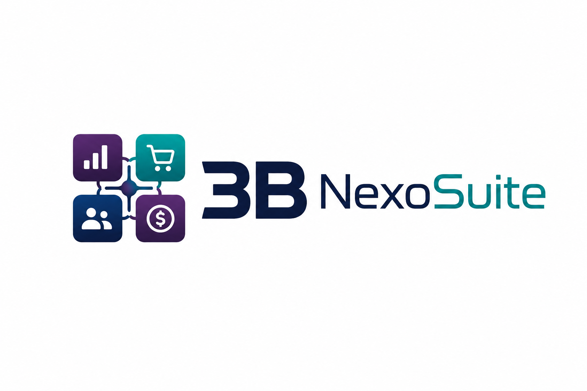

<div align="center">



# 3B NexoSuite ERP

### Modular ERP + E-commerce + CRM + Inventory + Accounting Platform

**One system to run sales, stock, finance, service and online business.**

<br>


<br>

[](landing-page/index.html)
[](landing-page/index.html)

</div>

---

## Overview

**3B NexoSuite ERP** is a modular business management platform built with **PHP 8+** and **MySQL/MariaDB**.

It combines ERP, e-commerce, CRM, inventory, accounting, procurement, service operations, reporting, security controls, customer portal, and trial license activation into one connected system.

It is designed for companies that need a practical platform to manage:

- online sales
- products and stock
- customers and leads
- orders and invoices
- accounting and reports
- suppliers and procurement
- service jobs and warranty
- customer portal access
- secure admin operations
- trial/demo activation

---

## Latest Update — Version 58.0

Version **58.0** improves production readiness, accounting workflow, reporting, attachments, security, and XAMPP compatibility.

| Area | Update |
|---|---|
| Accounting Suite | Improved accounting dashboard, reports, ledger drilldown, AP payments, supplier bills, VAT, assets, close workflow, and audit controls |
| Security Layer | Added sessions, CSRF, rate limits, request filtering, upload protection, login throttling, and audit logs |
| Security Center | Added `admin/erp/security-center.php` to monitor security events and login attempts |
| Scheduled Reports | Added Gmail Compose workflow with report links and manual sending |
| Attachment Viewer | Added document upload, file storage, image/PDF preview, and download links |
| Trial Balance | Account names now open detailed ledgers, including Cash & Bank transactions |
| Supplier Payments | Payments now connect to supplier bills and accounting reports |
| Reporting | Trial Balance, Profit & Loss, Balance Sheet, Cash Flow, and VAT reports now use accounting source logic |
| Mobile Storefront | Improved mobile drawer, language switcher, and currency selector |
| Product Pages | Improved product detail UI and mobile layout |
| Storefront Index | Updated automotive diagnostic software storefront style and article/product sections |
| Text Cleanup | Removed development wording from customer-facing accounting pages |
| XAMPP Compatibility | Adjusted `.htaccess` security rules to avoid Apache 500 errors on XAMPP |

---

## Demo Customer Access

Use the demo account below for customer testing.

| Field | Value |
|---|---|
| Customer Email | `3B-nexosuite@gmail.com` |
| Password | `3B-nexosuite@gmail.com` |
| Login Page | `your-domain.com/customer/login.php` |

For private customer delivery only, share the password through a secure message, not inside the public README.

---

## Import Database Under `general_trading_erp`

Use this section when you want to import the SQL database file into the local XAMPP database named:

```text
general_trading_erp
```

### Database Details

| Field | Value |
|---|---|
| Database Name | `general_trading_erp` |
| MySQL User | `root` |
| MySQL Password | No password |
| Environment | macOS XAMPP |

---

### Step 1 — Start XAMPP

Open **XAMPP Manager** and start:

```text
Apache
MySQL
```

---

### Step 2 — Create the Database

Open Terminal and run:

```bash
/Applications/XAMPP/xamppfiles/bin/mysql -u root -e "CREATE DATABASE IF NOT EXISTS general_trading_erp CHARACTER SET utf8mb4 COLLATE utf8mb4_unicode_ci;"
```

---

### Step 3 — Import the SQL File

If your SQL file is on the Desktop and named:

```text
general_trading_erp_full_backup.sql
```

Run this command:

```bash
/Applications/XAMPP/xamppfiles/bin/mysql -u root general_trading_erp < ~/Desktop/general_trading_erp_full_backup.sql
```

If your SQL file has another name, replace the file name in the command.

Example:

```bash
/Applications/XAMPP/xamppfiles/bin/mysql -u root general_trading_erp < ~/Desktop/your_database_file.sql
```

---

### Step 4 — Confirm the Import

Open phpMyAdmin:

```text
http://localhost/phpmyadmin
```

Then check:

```text
general_trading_erp
```

You should see all imported tables under the database.

---

### Step 5 — Connect the Project to the Database

Make sure the project database configuration uses:

```text
Database Host: localhost
Database Name: general_trading_erp
Database User: root
Database Password: empty / no password
```

---

### Step 6 — Test the System

Open the project in the browser:

```text
http://localhost/3B-nexosuite/
```

Then test:

- admin login
- customer login
- products
- categories
- orders
- accounting dashboard
- customer portal

---

### Import Notes

- Make sure the SQL file is not empty before importing.
- If the import fails because the database already has old tables, drop the database and recreate it.
- Do not upload SQL backup files to public GitHub repositories.
- Database backups may contain customers, orders, invoices, users, passwords, and private business data.
---

## Main Features

### Website & E-commerce

- Public storefront
- Product catalog
- Product categories
- Cart and checkout
- Online orders
- Contact page
- Blog/article pages
- Downloads
- SEO settings
- Currency selector
- Language selector
- Mobile commerce drawer

### Sales & CRM

- Customers
- Leads
- Opportunities
- Quotations
- Sales orders
- Follow-ups
- Campaigns
- Pipeline tracking

### Inventory

- Products
- SKUs
- Warehouses
- Branches
- Stock transfers
- Stock counts
- Reorder planning
- Inventory reports

### Finance & Accounting

- Accounting dashboard
- Invoices
- Supplier bills
- Supplier payments
- AP supplier ledger
- Bank accounts
- Bank reconciliation
- Account ledger
- Trial balance
- Profit and loss
- Balance sheet
- Cash flow
- VAT report
- VAT periods
- Tax filing workflow
- Fixed assets
- Depreciation runs
- Asset disposal
- Accounting periods
- Financial close
- Audit controls
- Scheduled reports
- Attachment viewer

### Procurement

- Suppliers
- Purchase orders
- RFQ workflow
- Tender management
- Supplier comparison
- Goods receipt
- Supplier statement
- AP supplier ledger

### Service Operations

- Job cards
- Service requests
- Warranty claims
- Technician workflow
- Projects
- Dispatch
- Customer sign-off

### Customer Portal

- Customer dashboard
- Order history
- Invoices
- Downloads
- Documents
- Service requests
- Support and feedback

### Admin & System

- Admin settings
- Security Center
- Backup and restore
- Deployment checklist
- Data manager
- Trial activation loader
- Owner activation generator
- System hardening
- License protection

---

## Supported Business Profiles

3B NexoSuite can be customized for multiple industries.

| Business Profile | Suitable For |
|---|---|
| Automotive | Garage equipment, automotive tools, diagnostic software, service workshops |
| Electronics | Mobile shops, accessories, devices, warranties, B2B electronics sales |
| Food Industry | Packaged food, beverages, catering, wholesale food operations |
| General Trading | Wholesale, B2B/B2C trading, inventory, suppliers, and procurement |

---

## Product Family

| Product Name | Purpose |
|---|---|
| **3B NexoSuite ERP** | Full business management platform |
| **3B NexoSuite Commerce** | E-commerce storefront and online sales |
| **3B NexoSuite CRM** | Leads, customers, opportunities, and sales pipeline |
| **3B NexoSuite Inventory** | Products, stock, warehouses, and transfers |
| **3B NexoSuite Finance** | Invoices, accounting, tax, and reports |
| **3B NexoSuite Portal** | Customer login, documents, invoices, and downloads |
| **3B NexoSuite Service** | Job cards, service requests, projects, and warranty |
| **3B NexoSuite Security** | Security events, access protection, and hardening controls |
| **3B NexoSuite Business Apps** | Modular app ecosystem |

---

## Recommended Hosting Requirements

| Requirement | Recommended Value |
|---|---|
| PHP Version | PHP 8.1 or newer |
| Database | MySQL / MariaDB |
| Web Server | Apache, LiteSpeed, or Nginx compatible |
| Local Development | XAMPP / Laragon / MAMP |
| SSL | Required for production |
| File Uploads | Enabled |
| Session Support | Enabled |
| Apache Headers | Recommended |

---

## Required PHP Extensions

```text
pdo_mysql
mysqli
mbstring
openssl
curl
zip
fileinfo
json
session
gd
intl
```

---

## Installation

### 1. Download or clone the project

```bash
git clone https://github.com/3bHussein/3B-nexosuite.git
cd 3B-nexosuite
```

### 2. Create a database

Create a new MySQL/MariaDB database.

Example:

```sql
CREATE DATABASE nexosuite_db CHARACTER SET utf8mb4 COLLATE utf8mb4_unicode_ci;
```

### 3. Upload or place project files

For local XAMPP:

```text
C:\xampp\htdocs\3B-nexosuite
```

For hosting:

```text
public_html/
```

### 4. Open the installer

Open the installer in your browser:

```text
http://localhost/3B-nexosuite/installer.php
```

or on hosting:

```text
https://your-domain.com/installer.php
```

### 5. Complete setup

During installation, enter:

- database host
- database name
- database username
- database password
- store/business name
- admin name
- admin email
- admin password
- business profile
- selected module bundle

### 6. Validate the system

After installation, check:

- admin login
- storefront
- products
- categories
- customers
- orders
- accounting dashboard
- reports
- customer portal
- security center
- activation loader

### 7. Delete installer

After installation, delete:

```text
installer.php
```

This is required for production security.

---

## Suggested Folder Structure

```text
3B-nexosuite/
├── admin/
│   └── erp/
│       ├── security-center.php
│       ├── accounting/
│       ├── reports/
│       └── settings/
├── customer/
│   ├── login.php
│   ├── dashboard.php
│   └── documents/
├── landing-page/
│   └── index.html
├── uploads/
├── assets/
├── installer.php
├── README.md
├── 3B_NexoSuite_ERP.png
└── 3B_NexoSuite_ERP_icon.png
```

> Folder names may vary depending on the final production package.

---

## Accounting Suite

The finance section has been upgraded into a more complete ERP accounting workflow.

| Module | Purpose |
|---|---|
| Accounting dashboard | Central finance overview and readiness status |
| Supplier bills | Create and manage supplier payable documents |
| Supplier payments | Post payments against supplier bills |
| AP supplier ledger | View supplier payable movement |
| Bank accounts | Manage bank and cash accounts |
| Bank reconciliation | Match bank records with accounting movement |
| Trial balance | View debits, credits, and account balances |
| Account ledger | Drill down into account transactions |
| Profit & Loss | Review revenue and expense performance |
| Balance Sheet | Review assets, liabilities, and equity |
| Cash Flow | Review cash movement |
| VAT Report | Review VAT input and output |
| VAT Periods | Manage tax periods |
| Tax Filing | Prepare tax filing workflow |
| Fixed Assets | Track fixed assets |
| Depreciation Runs | Process asset depreciation |
| Asset Disposal | Record asset disposal workflow |
| Attachments | Upload and view accounting evidence |
| Scheduled Reports | Prepare report emails through Gmail Compose |
| Financial Close | Review close workflow |
| Audit Controls | Support audit readiness and control checks |

### Trial Balance Drilldown

Example workflow:

```text
Trial Balance > Cash & Bank > Account Ledger
```

Cash & Bank ledger can include:

- bank opening movement
- customer receipts
- supplier payments
- running balance

---

## Scheduled Reports

Scheduled reports use a Gmail Compose workflow instead of SMTP.

This avoids:

- SMTP setup
- Gmail app password requirements
- XAMPP mail configuration problems
- blocked SMTP ports on local networks

### Workflow

1. Create a scheduled report.
2. Save the schedule.
3. Click **Open Gmail Compose**.
4. Gmail opens with:
   - recipient
   - subject
   - message body
   - report link
5. User sends the email manually from Gmail.

> Gmail Compose cannot auto-attach files from localhost. The report link is included in the email body, and the user can manually download and attach the report if needed.

---

## Attachment Viewer

Accounting documents support file upload and preview.

Supported file types:

```text
PDF, JPG, JPEG, PNG, WEBP, GIF, CSV, TXT, XLSX, XLS, DOCX, DOC
```

Features:

- upload accounting files
- store file metadata
- preview PDF files
- preview images
- download other file types
- link documents to accounting records
- safer filename handling
- upload extension allow-list

---

## Security Layer

Version 58.0 includes an overall software security layer.

| Protection | Description |
|---|---|
| Secure sessions | HttpOnly cookies, SameSite=Lax, and session regeneration |
| CSRF protection | Token required for POST requests |
| Auto CSRF injection | Header JavaScript adds CSRF token to POST forms |
| POST rate limit | Reduces repeated request abuse |
| Login throttling | Limits repeated login attempts |
| Security audit log | Records blocked requests and login events |
| Security Center | Admin view for security events |
| Upload hardening | File type allow-list, filename cleaning, and size limit |
| Request filtering | Blocks suspicious paths and traversal attempts |
| Safer redirects | Prevents unsafe external redirects |
| Security headers | Adds standard browser protection headers |
| XAMPP-safe `.htaccess` | Keeps protection while avoiding Apache 500 errors |

### Security Center

Security page:

```text
admin/erp/security-center.php
```

The page shows:

- recent security events
- login attempts
- blocked requests
- audit activity
- security status indicators

---

## XAMPP Compatibility

The `.htaccess` rules were adjusted to avoid HTTP 500 errors on XAMPP.

Removed from `.htaccess`:

```text
DirectoryMatch
ServerSignature
php_flag
```

Kept:

```text
directory listing protection
sensitive file blocking
upload execution blocking
safe security headers
```

If Apache shows a 500 error, check:

```text
C:\xampp\apache\logs\error.log
```

---

## Trial Activation System

3B NexoSuite includes a customer-specific trial and activation system.

### Default Trial Limits

| Area | Trial Limit |
|---|---:|
| Products | 5 |
| Categories | 5 |
| Customers | 5 |
| Orders | 5 |

When the trial limit is reached, the system displays an activation message and blocks new record creation until activation is completed.

Existing records remain safe and visible.

### Recommended Activation Message

```text
Please activate your 3B NexoSuite license to continue creating new records.
```

### Customer-Specific Request Code

Each installation can generate a unique request code based on:

- installation UID
- domain or localhost path
- database name
- database prefix
- shop name
- shop email
- app encryption key fingerprint

### Safe License Control

The activation system should be non-destructive.

It should not:

- delete customer records
- damage database tables
- corrupt files
- encrypt customer data after the trial limit
- block customers from viewing existing records

It should only block new record creation after the trial limit until activation is completed.

---

## Database Export / Backup

Use this section to export the full database before moving the project, updating files, or delivering the system to a customer.

### Database Details

| Item | Value |
|---|---|
| Database Name | `general_trading_erp` |
| MySQL User | `root` |
| MySQL Password | No password |
| Environment | macOS XAMPP |

---

### Export Full Database Using Terminal

Open **Terminal** on macOS and run:

```bash
/Applications/XAMPP/xamppfiles/bin/mysqldump -u root general_trading_erp > ~/Desktop/general_trading_erp_backup.sql
```

This will create the SQL backup file on your Desktop:

```text
general_trading_erp_backup.sql
```

---

### Recommended Full Export Command

For a more complete backup including tables, fields, data, triggers, routines, and events, use:

```bash
/Applications/XAMPP/xamppfiles/bin/mysqldump -u root --routines --triggers --events --single-transaction general_trading_erp > ~/Desktop/general_trading_erp_full_backup.sql
```

This will create:

```text
general_trading_erp_full_backup.sql
```

---

### Export All Databases

To export all local XAMPP databases:

```bash
/Applications/XAMPP/xamppfiles/bin/mysqldump -u root --all-databases > ~/Desktop/all_databases_backup.sql
```

---

### Check That the Export File Was Created

After running the export command, check your Desktop for:

```text
general_trading_erp_full_backup.sql
```

You can also confirm from Terminal:

```bash
ls -lh ~/Desktop/general_trading_erp_full_backup.sql
```

If the file size is greater than `0B`, the export was created.

---

### Restore Database Later

If you need to restore the backup later, first create the database:

```bash
/Applications/XAMPP/xamppfiles/bin/mysql -u root -e "CREATE DATABASE general_trading_erp CHARACTER SET utf8mb4 COLLATE utf8mb4_unicode_ci;"
```

Then import the SQL backup:

```bash
/Applications/XAMPP/xamppfiles/bin/mysql -u root general_trading_erp < ~/Desktop/general_trading_erp_full_backup.sql
```

---

### Notes

- Make sure **Apache** and **MySQL** are running in XAMPP before export/import.
- Keep the SQL backup file safe.
- Do not upload database backups to public GitHub repositories.
- Do not share SQL backups publicly because they may contain customer data, admin users, passwords, orders, invoices, and business information.

---

## Production Checklist

Before customer delivery:

- [ ] Configure database credentials
- [ ] Confirm admin login works
- [ ] Confirm storefront loads
- [ ] Confirm product creation works
- [ ] Confirm category creation works
- [ ] Confirm customer creation works
- [ ] Confirm order creation works
- [ ] Confirm accounting dashboard loads
- [ ] Confirm supplier bills work
- [ ] Confirm supplier payments work
- [ ] Confirm Trial Balance loads
- [ ] Confirm Profit & Loss loads
- [ ] Confirm Balance Sheet loads
- [ ] Confirm Cash Flow loads
- [ ] Confirm Attachment Viewer uploads and previews files
- [ ] Confirm scheduled report Gmail Compose opens correctly
- [ ] Confirm Security Center loads
- [ ] Confirm `.htaccess` does not cause Apache 500 error
- [ ] Enable SSL on production hosting
- [ ] Use a strong admin password
- [ ] Backup database and files
- [ ] Delete `installer.php` after installation

---

## Security Notes

- Keep the owner activation generator private.
- Do not upload private activation tools to customer hosting.
- Do not publish real passwords in this README.
- Always delete `installer.php` after installation.
- Always enable SSL in production.
- Always use a strong admin password.
- Always backup the database before major changes.
- Validate in staging before production use.
- Keep upload folders protected.
- Review Security Center after deployment.
- Keep server logs and backups available.
- Do not expose `.env`, SQL backups, activation tools, or private keys.

---

## Landing Page

The landing page source is available here:

```text
landing-page/index.html
```

Use it as the public product page or storefront introduction for 3B NexoSuite ERP.

---

## Sales Positioning

> **3B NexoSuite is a modular ERP and e-commerce platform for growing businesses. It combines online sales, inventory, customers, orders, accounting, CRM, procurement, service workflows, security controls, and customer portal features into one connected business system.**

---

## Hero Text

```text
3B NexoSuite ERP

One system to run sales, stock, finance, service and online business.

Manage products, customers, orders, inventory, accounting, CRM, procurement, reporting, security and e-commerce from one powerful modular platform.
```

---

## CTA Text

```text
Request a Live Demo
```

```text
Start Your Business ERP Setup
```

```text
Activate Your 3B NexoSuite License
```

---

## Roadmap

Planned future improvements:

- SaaS subscription dashboard
- Multi-company support
- Role-based permissions
- Advanced stock valuation
- Payment gateway integrations
- WhatsApp notification workflow
- Email template builder
- PDF quotation and invoice templates
- More advanced reporting dashboard
- API endpoints for external integrations

---

## Commercial Disclaimer

3B NexoSuite is intended as a commercial ERP and e-commerce platform.

Validate the system in a staging environment before production deployment.

Always keep backups before installing, updating, or modifying a live customer system.

---

## Brand Owner

**3B**

---

<div align="center">


## 3B NexoSuite

**Modular ERP + E-commerce + CRM + Inventory + Accounting Platform**

**One system to run sales, stock, finance, service and online business.**

**Latest Update: Version 58.0 — Accounting, Security, Reporting and Production Readiness**

</div>
